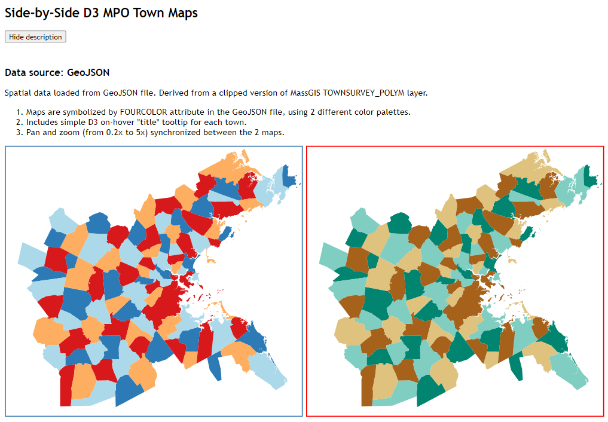

# d3-side-by-side-maps
Demo illustrating how to generate two "synchonized" maps using d3.js

This demo app makes use of the following external resources loaded from a CDN:
* jQuery version 1.12.4
* D3 vesrion 3.5.17

